# 🍩 DOH-NUT™ Master Brand Guidelines & Visual Standard (v2.5)

> **"DOH-NUT bukan sekadar jenama donut. Ia adalah jenama kulinari digital Malaysia yang menggabungkan nostalgia kinestetik doh plastisin (Tactile Claymation), budaya makanan tempatan, dan tenaga streetwear moden."**

---

## 🎨 1. Konsep Utama: Tactile Claymation Hero

Setiap penghasilan visual, kempen pemasaran, dan reka bentuk antaramuka DOH-NUT berakar daripada estetika doh buatan tangan yang montok, berkilat, dan ceria.

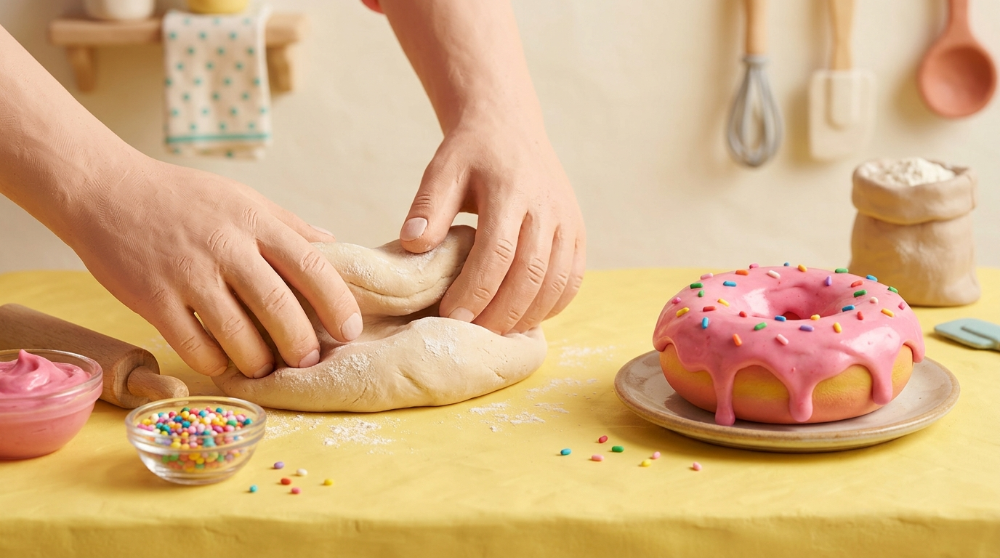
*Rajah 1.1: Visual Standard Konsep Claymation — Tangan menguli doh kenyal di atas meja kuning mentega bersama donat glaze strawberi dan manik pelangi.*

---

## 📑 2. Identiti Teras & Hakikat Jenama (Brand Truth)

| Elemen | Spesifikasi Rasmi | Nota Penguatkuasaan |
| :--- | :--- | :--- |
| **Nama Rasmi** | **DOH-NUT™** | Wajib bersekat tanda sempang (`-`). Dilarang: *DohNut*, *DOWGNUT*, atau *dohnuts*. |
| **Tagline Utama** | **"GOOD VIBE. GOOD DOH."** | Dipaparkan pada pembungkusan, splash screen, dan bio profil media sosial. |
| **Tagline Sekunder** | *"Something good is taking shape."* | Digunakan untuk video penceritaan proses doh mengembang dan pra-pelancaran. |
| **Panggilan / Hook** | **"WHAT'S YOUR FLAVA?"** | Tipografi graffiti jalanan pada skrin utama dan menu pemilihan donat. |
| **Asal & Geografi** | Malaysian-Born · Artisan Bakery | Berpangkalan di Lembah Klang (KL & Selangor), dihantar dalam 18–25 minit. |
| **Karakter & Maskot** | **DOH BOY™** | Maskot doh kenyal yang bertindak sebagai concierge AI interaktif. |
| **Katalog Produk** | **31 Perisa Rasmi** | 4 Kategori: *Classic*, *Sprinkled*, *Stuffed*, *Specialty (Sira Series)*. |

---

## 🎨 3. Sistem Warna Kalibrasi Rasmi (Color Architecture)

Warna DOH-NUT direka berdasarkan tekstur kulinari sebenar dan mematuhi penarafan kontras aksesibiliti Web (WCAG AA/AAA):

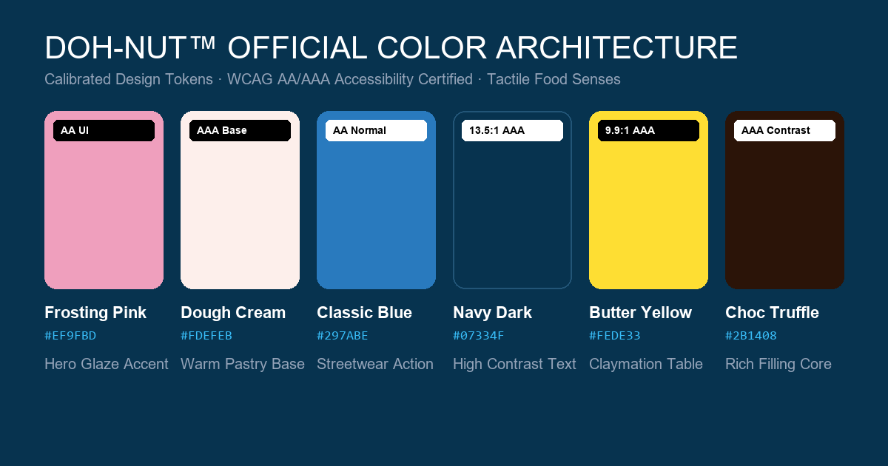
*Rajah 3.1: Matriks Kad Warna Rasmi — 6 Token Taktil bersama kod HEX, RGB, dan Penarafan Kontras WCAG.*

### Kod Token CSS (Design Tokens):
```css
:root {
  --color-frosting-pink: #EF9FBD; /* Glaze Strawberi Hero (AA UI) */
  --color-dough-cream:   #FDEFEB; /* Permukaan Doh Panas (AAA Base) */
  --color-classic-blue:  #297ABE; /* Streetwear Action & Toggle (AA) */
  --color-navy-dark:     #07334F; /* Teks Utama & Tajuk (13.5:1 AAA) */
  --color-butter-yellow: #FEDE33; /* Meja Claymation & Streak 🔥 (9.9:1 AAA) */
  --color-truffle-choc:  #2B1408; /* Inti Coklat Pekat & Aksen Nutrisi */
}
```

---

## 🍩 4. Seni Bina Visual 3-Donat Menegak (The 3-Donut Kinesthetic Stack)

Skrin utama kedai (`shop-home.tsx`) menampilkan susunan menegak 3 donat bertindih dengan negatif margin `-space-y-6`. Sentuhan pada mana-mana donat beralih dengan lancar ke kanvas 3D Ring Slider.

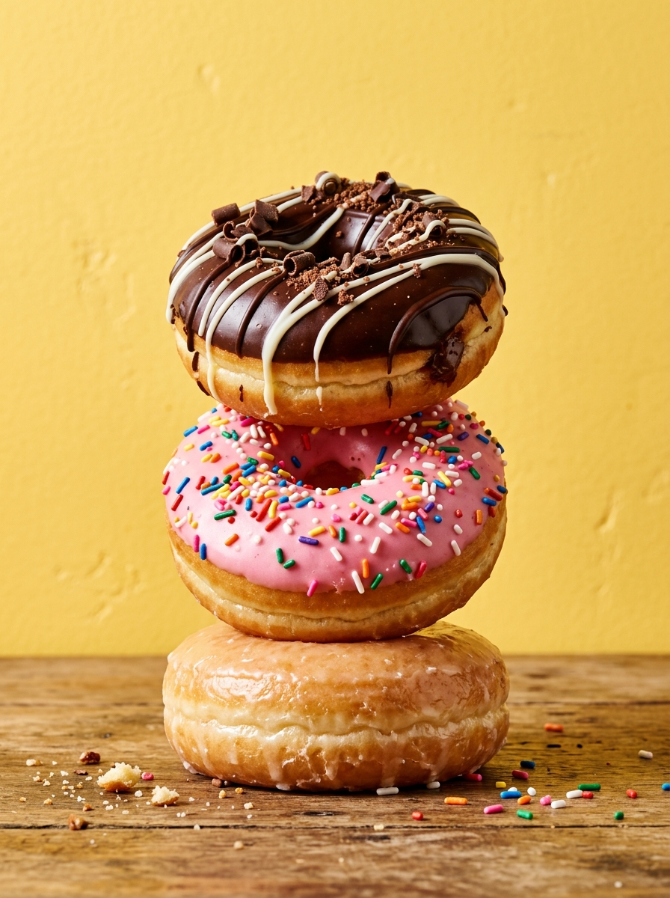
*Rajah 4.1: Konsep Susunan 3 Donat Menegak — Classic Glazed (Bawah), Berry Sprinkled (Tengah), dan Chocolate Stuffed (Atas).*

### Tiga Donat Ikonik:
1. **Classic Glazed (Lapisan Bawah)**: Donat gebu keemasan bersalut kerak gula halus lutsinar.
2. **Berry Sprinkled (Lapisan Tengah)**: Glaze strawberi merah jambu pekat dengan taburan manik gula pelangi beraneka warna.
3. **Chocolate Stuffed (Lapisan Atas)**: Donat berkrim kastard kaya dengan siraman coklat truffle dan parutan coklat rangup.

### 4.1 Kinematik Putaran Donat 360° Menyeluruh (The 3-Screen Rolling Rotation):
Peralihan antara skrin mematuhi fizik kinestetik berterusan tanpa kehilangan visual (*zero-blink shared layout*):
* **Skrin 1 (Home Stack)**: Donat berada pada kedudukan menegak `rotate: 0°`.
* **Skrin 2 (3D Ring Slider)**: Klik pada donat kategori melancarkan transisi `layoutId` di mana donat berguling 360° mengikut arah jam (`rotate: 360°`) sepanjang **`2.1s`** dengan keluk `easeInOutCubic` (`[0.37, 0, 0.63, 1]`). Donat jiran memudar masuk pada `delay: 0.7s` (`scale: 0.6 ➔ 1`), dan kad bawah meluncur naik pada `delay: 0.75s`.
* **Skrin 3 (Half-Donut Split Detail)**: Donat tengah meluncur ke sisi kanan (*bleed-off*) sambil melengkapkan putaran 360° seterusnya kepada `rotate: 720°` sepanjang **`2.1s`**. Panel nutrisi empat metrik (*Salt, Sugar, Fat, Energy*) muncul berperingkat pada `delay: 0.4s – 0.7s`.
* **Arah Balik (Back Navigation)**: Berputar kembali secara lawan jam (`720° ➔ 360° ➔ 0°`) secara lancar tanpa sebarang kelipan atau lonjakan.

---

## 🎬 5. Standard Penceritaan Kinestetik Claymation (6-Phase Arc)

> **Sumber Kebenaran Konsep Mutlak (Canonical Benchmark Video):**  
> `G:\Downloads\Claymation_hands_making_donut_video_20260910104943.mp4`

Video ini merupakan contoh yang paling betul bagi konsep jenama DOH-NUT™. Semua video, poster, dan animasi wajib menepati gaya visual tangan plastisin kuning, meja kuning mentega (`#FEDE33`), gorengan minyak berbuih keemasan, sos glaze merah jambu likat (`#EF9FBD`), hujan manik pelangi, dan lencana logo 3D merah-biru.


*Rajah 5.1: Pemetaan 8 Bingkai Sebenar daripada Video Rujukan Rasmi (Claymation_hands_making_donut_video_20260910104943.mp4).*

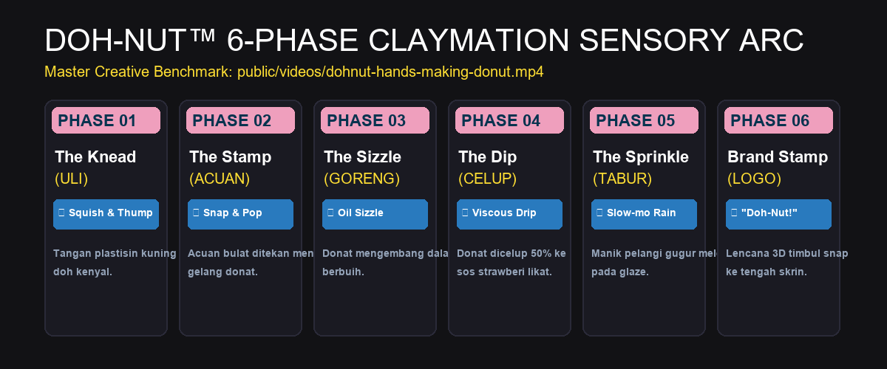
*Rajah 5.2: Storyboard Kinestetik 6-Fasa — Aliran penceritaan dari Uli hingga Snap Logo bersama padanan SFX.*

| Fasa | Tindakan Visual | Reka Bentuk Bunyi (SFX Web Audio API) |
| :--- | :--- | :--- |
| **01. ULI (The Knead)** | Tangan plastisin kuning menguli doh kenyal di atas meja butter yellow (`#FEDE33`). | Bunyi lecekan doh kenyal *(squish & thump)*. |
| **02. ACUAN (The Stamp)** | Acuan pemotong bulat ditekan kemas menghasilkan gelang donat. | Bunyi pemotongan kemas *(snap & pop)*. |
| **03. GORENG (The Sizzle)** | Donat mengembang dalam minyak panas berbuih keemasan. | Bunyi minyak mendidih berdesir *(crisp oil sizzle)*. |
| **04. CELUP (The Dip)** | Donat dicelup 50% ke sos frosting merah jambu likat (`#EF9FBD`). | Bunyi celupan likat meleleh *(viscous drip & splat)*. |
| **05. TABUR (The Sprinkle)** | Manik gula pelangi gugur perlahan (*slow-mo rain*) melekat pada glaze. | Bunyi gemersik rangup *(crunchy sprinkles)*. |
| **06. LOGO SNAP** | Lencana 3D timbul DOH-NUT snap ke tengah skrin. | Dentuman haptik + vokal jenama *"Doh-Nut!"*. |

---

## 📦 6. Pembungkusan Taktil & Pengalaman Unboxing

Kotak penghantaran DOH-NUT direka sebagai medium visual jenama yang menonjolkan gaya hidup jalanan dan kulinari premium:


*Rajah 6.1: Pengalaman Pembungkusan Taktil — Kotak kuning mentega dengan logo graffiti timbul, kertas kalis minyak bercorak monogram, dan 4 donat artisan.*

### Ciri-Ciri Pembungkusan:
* **Warna Kotak Luar**: Kuning mentega pejal (`#FEDE33`) dengan cetakan timbul UV logo DOH-NUT biru/merah jambu.
* **Kertas Pelapik Kalis Minyak (Greaseproof Liner)**: Cetakan monogram DOH BOY™ dan manik taburan menggunakan dakwat soya mesra makanan.
* **Meterai Keselamatan**: Pelekat merah keselamatan bertulis *"SEALED FRESH FOR YOU"*.
* **Sisipan Poskad Koleksi**: Setiap kotak memuatkan salah satu daripada 10 poskad kempen parodi.

---

## 🖼️ 7. Galeri 10 Poster Parodi Rasmi (Posters 21–30)

Siri poster promosi budaya pop bertema tempatan yang telah disahkan dan sedia untuk kempen media sosial 30 hari:

| Poster 21: Malaysia Runs on Doh | Poster 22: Doh Tarik |
| :---: | :---: |
| 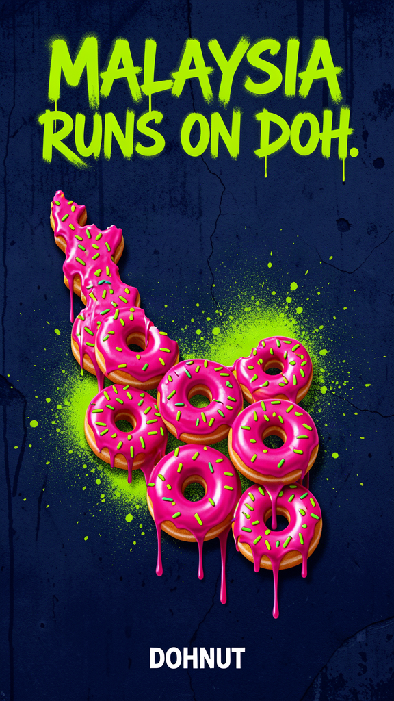 | 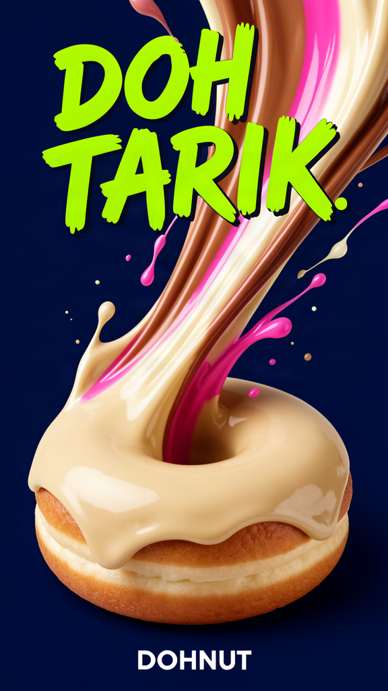 |
| *Semangat pagi rakyat Malaysia.* | *Buih teh tarik karamel meleleh.* |

| Poster 23: Doh-lo Dinosaur | Poster 24: Old School New Doh |
| :---: | :---: |
| 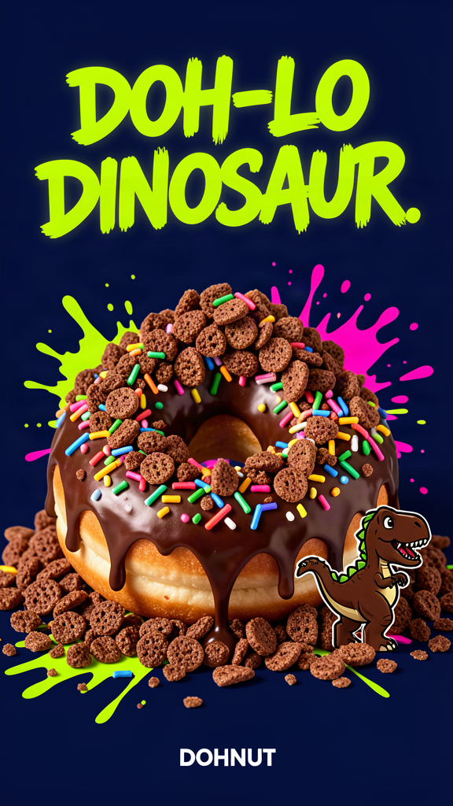 | 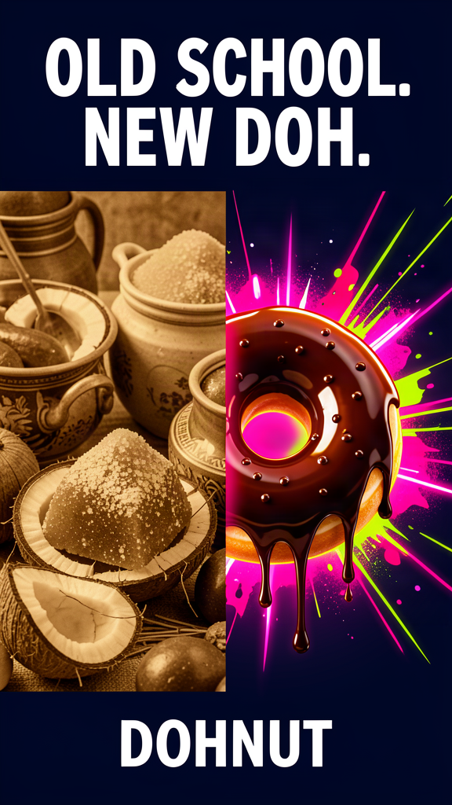 |
| *Gunung serbuk coklat malt.* | *Kuih Keria & Sira Sambal.* |

| Poster 25: Doh King (Durian) | Poster 26: Sweet Then Spicy |
| :---: | :---: |
| 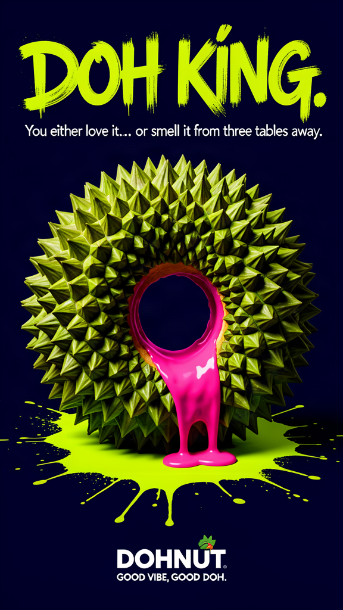 | 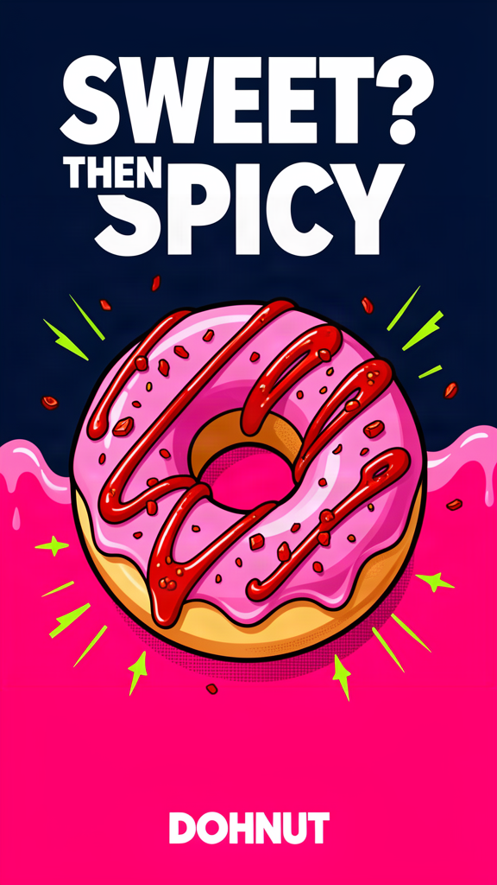 |
| *Kastard Durian D24 asli.* | *Gula Melaka & sentuhan cili padi.* |

| Poster 27: Drop Don't Think | Poster 28: Bad Day Good Doh |
| :---: | :---: |
| 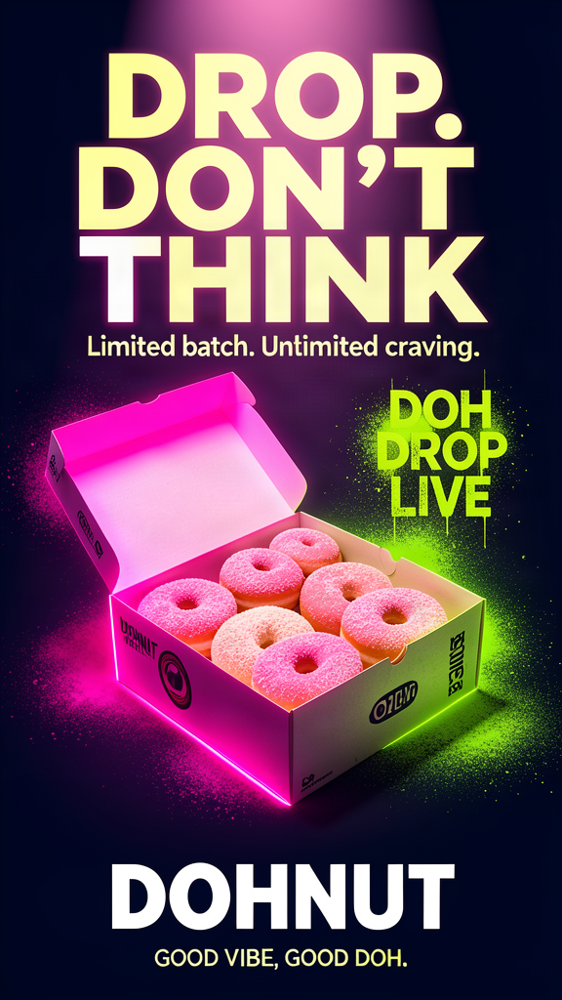 | 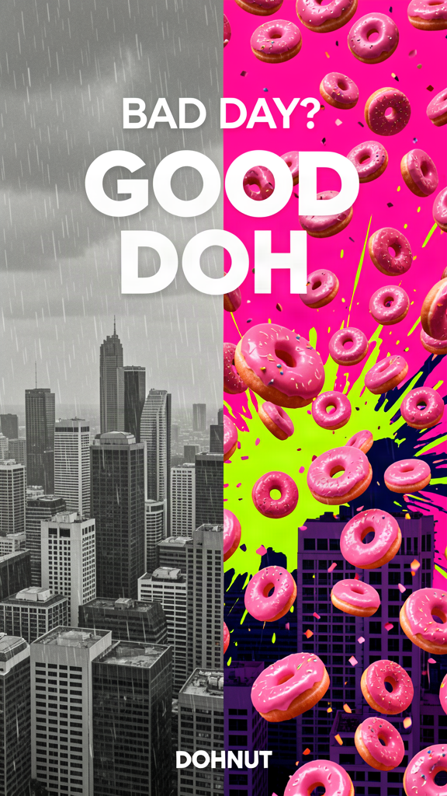 |
| *Craving donat lewat malam.* | *Terapi emosi donat panas.* |

| Poster 29: Open The Doh | Poster 30: Good Vibe Good Doh |
| :---: | :---: |
| 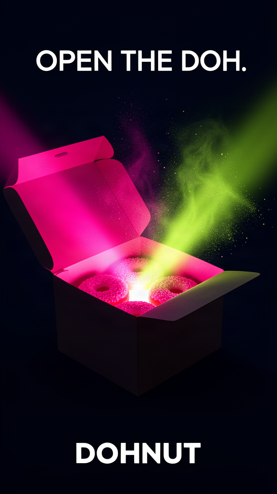 | 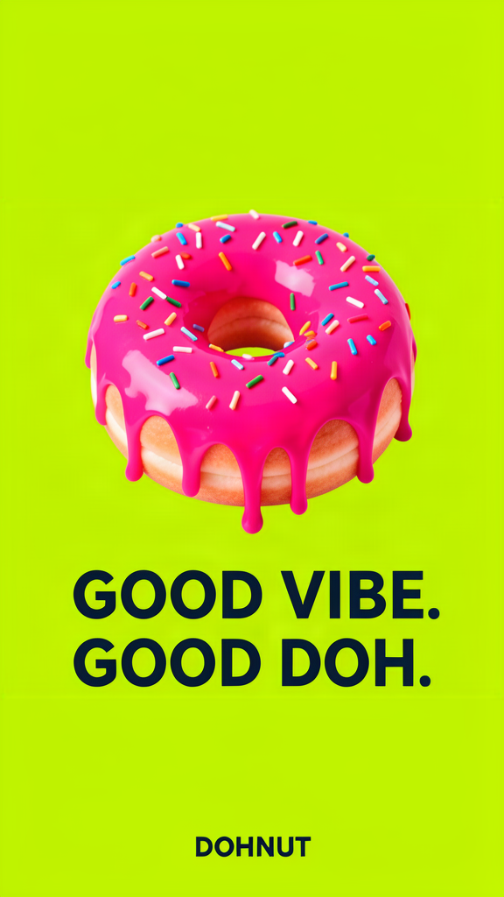 |
| *Pengalaman unboxing kotak taktil.* | *Lagu tema komuniti peminat DOH.* |

---

## 📱 8. Bukti Pengesahan Halaman Profil Media Sosial (`@thisisdohnut`)

Semua 5 saluran media sosial rasmi telah diaudit dan disahkan melalui tangkapan skrin pelayar sebenar:

| Saluran | Bukti Visual Tangkapan Skrin | Spesifikasi Profil Disahkan |
| :--- | :---: | :--- |
| **TikTok** (`@thisisdohnut`) |  | Bio: *"DOH-NUT PANIC 🍩💥 MY Malaysian Flava. GOOD VIBE. GOOD DOH."* |
| **Instagram** (`@thisisdohnut`) |  | Highlights: Menu, Claymation, Delivery, Doh Lang, Reviews |
| **Threads** (`@thisisdohnut`) |  | Bio: *"The dough is real. Daily thoughts, fresh drops & unhinged food takes."* |
| **Facebook** (`Doh Nut`) |  | Pautan WebStore, Info Kedai, dan Komuniti Lembah Klang |
| **YouTube** (`@thisisdohnut`) |  | Shorts FYP 9:16 & Video Penuh Pembuatan Donat 16:9 |

---

## 🛡️ 9. Standard Ketukangan Emil Kowalski (Zero-Jitter & Mobile-First)

Setiap elemen antaramuka web dan aplikasi Mini App WAJIB mematuhi dua peraturan ketukangan mutlak:

### A. Peraturan Sifar Goyangan Butang (The Zero-Jitter Invariant):
1. **Dilarang `.glass` pada Elemen Interaktif**: Jangan gunakan `backdrop-filter: blur()` pada butang tindakan. Gunakan latar pejal/matte berbingkai tajam 1px.
2. **Dilarang `scale()` pada Hover**: Hover tidak boleh mengubah saiz dimensi butang (mengelakkan goyangan kursor).
3. **Elevasi Halus & Mampatan Sentuh**:
   ```css
   .btn, button {
     transition: transform 120ms cubic-bezier(0.16, 1, 0.3, 1),
                 background-color 150ms ease,
                 box-shadow 150ms ease;
   }
   @media (hover: hover) and (pointer: fine) {
     .btn:hover {
       transform: translateY(-1px); /* Elevasi 1px sahaja */
     }
   }
   .btn:active {
     transform: scale(0.97); /* Mampatan sentuh visual segera */
   }
   ```

### B. Seni Bina Mudah Alih Sifar Pertindihan (Mobile-First Zero-Overlap):
* Kontena halaman utama WAJIB mempunyai ruang pelepasan bawah selamat:
  ```css
  main, .page-container {
    padding-bottom: calc(140px + env(safe-area-inset-bottom, 28px)) !important;
    scroll-padding-bottom: 36px;
  }
  ```
* Dok terapung navigasi bawah tidak akan sesekali bertindih atau menutupi butang tindakan pesanan pada mana-mana peranti telefon pintar.

---

## 📋 10. Lejer Semakan & Pengauditan (SMS-v1.0 Audit Ledger)

| Versi | Cap Masa (MYT) | Pengarang | Niat / Sebab Perubahan | Butiran Pengubahsuaian | Bukti Pengesahan |
| :--- | :--- | :--- | :--- | :--- | :--- |
| `2.6.0` | 2026-09-16 04:20:00 | Sovereign Conductor & GangBo | Penyelarasan Kinematik Putaran 360° Menyeluruh & 2.1s (-20%) | Ditambah Seksyen 4.1: 0° ➔ 360° ➔ 720° berterusan pada 2.1s easeInOutCubic [0.37, 0, 0.63, 1], siblings delay 0.7s | `bun test`: 62/62 pass, `bun run build`: 14/14 OK |
| `2.5.0` | 2026-09-16 04:00:00 | Sovereign Conductor & GangBo | Ilustrasi Penuh Brand System dengan Imej Nyata | Menyuntik 15 imej visual: Claymation Hero, Palet Warna 6-Token, Susunan 3 Donat, Storyboard 6-Fasa, Kotak Unboxing, 10 Poster Parodi, dan Bukti 5 Saluran Media Sosial | Semua fail imej fizikal disahkan wujud di `./assets/` |
| `2.0.0` | 2026-09-16 03:50:00 | Sovereign Conductor & GangBo | Peningkatan teks Brand Guidelines v2.0 | Penyelarasan kod warna rasmi, piawaian Zero-Jitter, 10 poster parodi, dan 6-fasa claymation | Baseline text update |
