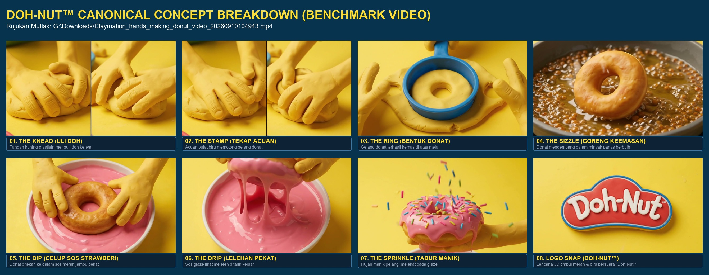
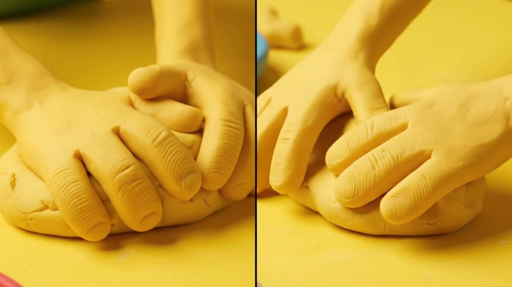
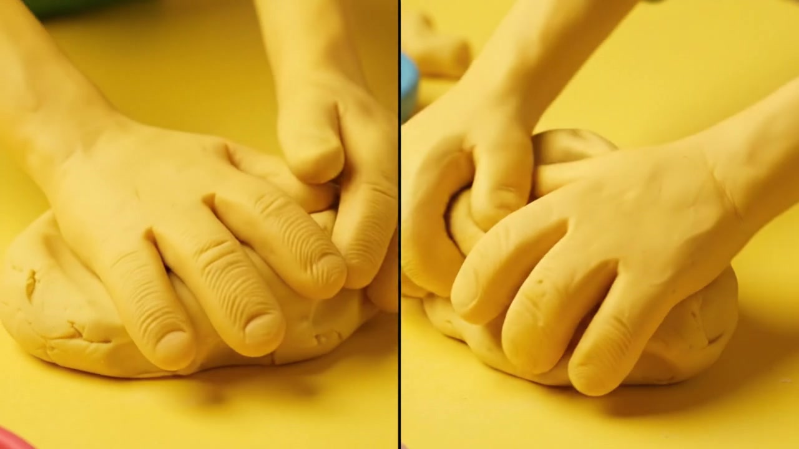
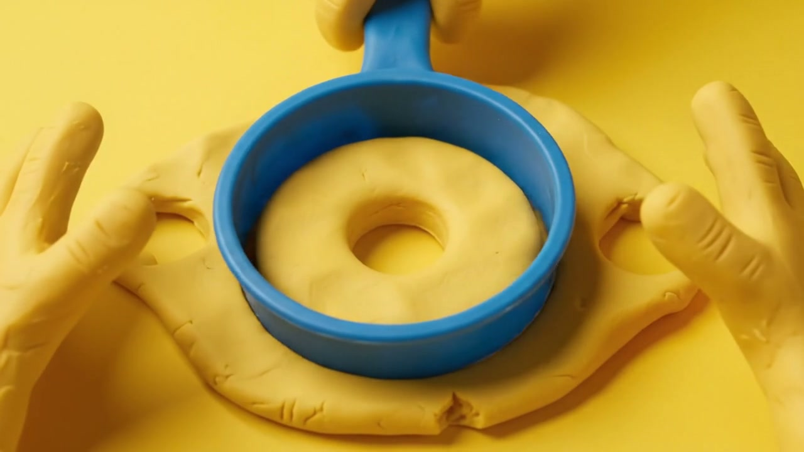
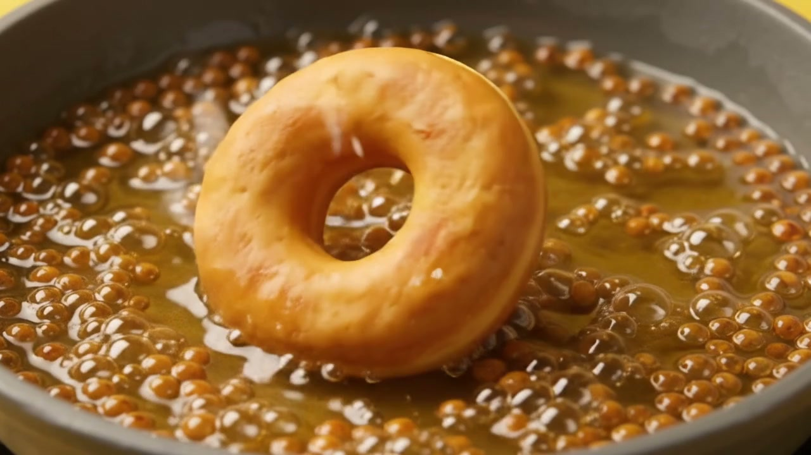
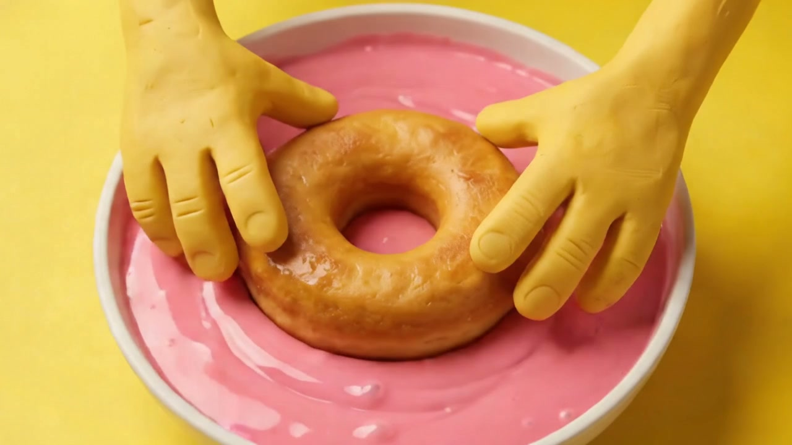
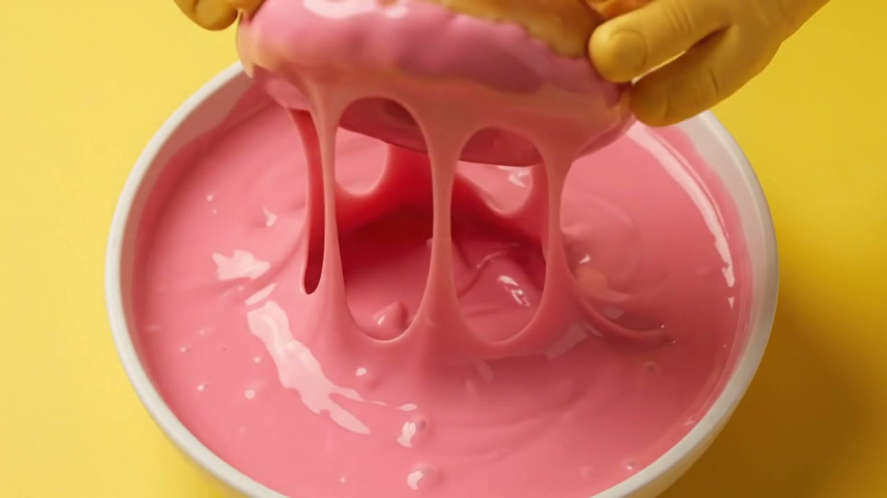
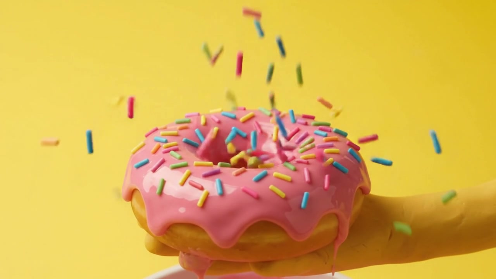
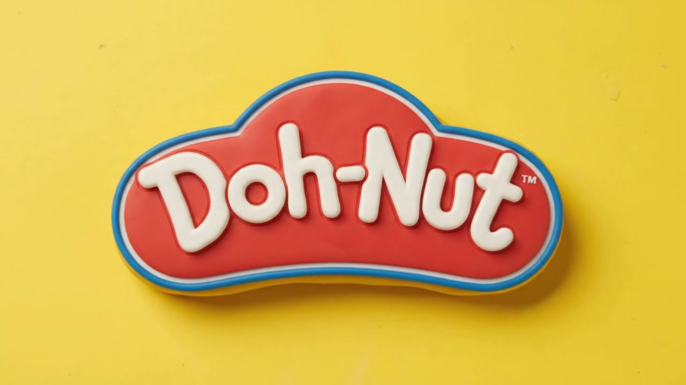

# 🍩 Master Concept Guidelines: The Canonical Claymation Standard

> **SUMBER KEBENARAN KONSEP MUTLAK (CANONICAL BENCHMARK):**  
> `G:\Downloads\Claymation_hands_making_donut_video_20260910104943.mp4`

Video ini merupakan **contoh yang paling betul dan muktamad** bagi konsep jenama **DOH-NUT™**. Semua penghasilan video baharu, poster promosi, animasi 3D, kempen media sosial, dan estetika antaramuka web **WAJIB MENIRU DAN MEMATUHI 100% GAYA VISUAL, RENTAK, DAN ELEMEN VIDEO INI**.

---

## 🎬 1. Grid Konsep Master (Frame-by-Frame Proof)

*Rajah 1.1: Pemetaan 8 Bingkai Sebenar daripada Video Rujukan Rasmi (G:\Downloads\Claymation_hands_making_donut_video_20260910104943.mp4).*

---

## 🔍 2. Bedah Siasat Terperinci Bingkai Video Rujukan (Frame Analysis)

| Fasa & Cap Masa | Bingkai Sebenar Video | Tindakan Kinestetik & Spesifikasi Estetika | Bunyi & ASMR (Web Audio) |
| :--- | :---: | :--- | :--- |
| **01. ULI DOH** `00:00 - 00:01` |  | **Tangan Kuning Plastisin**: Tangan kartun claymation kuning cerah (bukan tangan manusia sebenar) dengan tekstur garis jari menguli doh kenyal lembut di atas meja kuning mentega (`#FEDE33`). | Lecekan doh kenyal berirama *(squish & rhythmic thump)*. |
| **02. TEKAP ACUAN** `00:01 - 00:02` |  | **Acuan Bulat Biru**: Alat pemotong donat plastik biru diraja (`#297ABE`) ditekan pantas ke atas doh, memotong lubang tengah dan bentuk gelang. | Bunyi pemotongan kemas *(snap & pop)*. |
| **03. GELANG DONAT** `00:02 - 00:03` |  | **Bentuk Donat Terhasil**: Gelang donat mentah gebu terbentuk kemas, tangan mengangkat lebihan doh di sekelilingnya. | Bunyi doh terpisah lembut *(soft separation)*. |
| **04. GORENG KEEMASAN** `00:03 - 00:05` |  | **Minyak Panas Berbuih**: Donat masuk kuali minyak mendidih dengan buih-buih halus keemasan dan wap panas, menghasilkan kerak gorengan rangup (*golden crispy crust*). | Bunyi desiran minyak panas mendidih *(crisp oil sizzle & bubble)*. |
| **05. CELUP SOS** `00:05 - 00:06` |  | **Mangkuk Glaze Strawberi**: Dua tangan kuning menekan donat goreng ke dalam mangkuk seramik putih berisi sos merah jambu strawberi likat (`#EF9FBD`). | Bunyi mampatan sos pekat *(viscous squelch)*. |
| **06. LELEHAN PEKAT** `00:06 - 00:07` |  | **Glaze Menitis Pekat**: Donat diangkat dengan lelehan sos strawberi likat yang menitik ke dalam mangkuk, menonjolkan kilauan berkrim. | Bunyi titisan sos likat *(slow viscous drip & splash)*. |
| **07. TABUR MANIK** `00:07 - 00:09` |  | **Hujan Manik Pelangi**: Tangan kuning memegang donat bersalut glaze sementara manik gula pelangi (biru, hijau, merah, kuning) gugur perlahan (*slow-motion rain*) melekat pada sos. | Bunyi gemersik manik gula rangup *(crunchy sprinkles fall)*. |
| **08. LOGO SNAP** `00:09 - 00:10` |  | **Lencana 3D Doh-Nut™**: Lencana plastisin merah awan dengan garisan sempadan biru dan teks timbul putih **Doh-Nut™** melompat ke tengah skrin dengan vokal audio bertenaga. | Dentuman haptik + Vokal jenama rasmi: *"Doh-Nut!"*. |

---

## 🎯 3. Peraturan Mutlak Untuk Semua Video, Poster & Konsep Masa Hadapan

Setiap pereka, artis animasi, atau ejen AI yang menghasilkan video atau poster DOH-NUT **WAJIB MEMATUHI 5 PERATURAN MUTLAK INI**:

1. **Wajib Tangan Kartun Plastisin Kuning**:
   - Dilarang sama sekali menggunakan tangan manusia berkulit nyata atau tangan CGI generik.
   - Wajib tangan kuning getah/plastisin bertekstur claymation (seperti karakter The Simpsons / Play-Doh).
2. **Wajib Latar Belakang Kuning Mentega (`#FEDE33` / `#FDE047`)**:
   - Suasana keseluruhan mestilah ceria, bertenaga, hangat, dan monokromatik kuning ikonik.
3. **Wajib Kontras Tekstur Kulinari (Crisp + Viscous + Crunchy)**:
   - Menggabungkan 3 sensasi deria rasa: Kerak gorengan minyak berdesir, lelehan sos glaze merah jambu pekat melekat, dan taburan manik pelangi rangup.
4. **Wajib Bentuk Logo 3D Awan Merah & Biru**:
   - Lencana logo rasmi berasaskan bentuk plastisin merah timbul berbingkai biru dengan huruf putih **Doh-Nut™** (berserta tanda tanda dagangan kecil `™`).
5. **Wajib Dentuman Audio & Vokal Signature**:
   - Penamat video sentiasa diakhiri dengan audio pop haptik dan laungan vokal ceria: *"Doh-Nut!"*.
6. **Wajib Terjemahan Kinematik Web UI (The 2.1s Rolling Rotation Continuum)**:
   - Pengalaman aplikasi web menterjemahkan sentuhan plastisin fizikal ke dalam pergerakan donat berguling 360° yang lancar (`rotate: 0° ➔ 360° ➔ 720°`) sepanjang **`2.1s`** (`easeInOutCubic: [0.37, 0, 0.63, 1]`) merentasi Home, 3D Slider, dan Split Detail.

---

## 📋 4. Lejer Semakan & Pengauditan (SMS-v1.0)
| Versi | Cap Masa (MYT) | Pengarang | Niat Perubahan | Butiran Pengubahsuaian | Bukti Pengesahan |
| :--- | :--- | :--- | :--- | :--- | :--- |
| `3.1.0` | 2026-09-16 04:20:00 | Sovereign Conductor & GangBo | Penyelarasan Kinematik Web 360° (2.1s) | Menambah Peraturan 6: Terjemahan fizikal claymation ke antaramuka web (0° ➔ 360° ➔ 720° @ 2.1s easeInOutCubic) | `bun test`: 62/62 pass, `bun run build`: 14/14 OK |
| `3.0.0` | 2026-09-16 04:05:00 | Sovereign Conductor & GangBo | Pematuhan Penuh Video Rujukan Mutlak | Mengekstrak 8 bingkai sebenar daripada `Claymation_hands_making_donut_video_20260910104943.mp4`, menjana grid master 2x4, dan menguatkuasakan 5 peraturan mutlak video & poster | 8 fail bingkai disahkan wujud di `./assets/video-breakdown/` |
| `2.0.0` | 2026-09-16 04:00:00 | Sovereign Conductor & GangBo | Suntikan Imej Visual Konsep | Menambah Rajah Claymation Hero dan Storyboard | File verified |
| `1.0.0` | 2026-09-12 05:20:00 | Sovereign Conductor | Asas standard claymation | Penceritaan 6 fasa dan video rujukan | Baseline approval |
