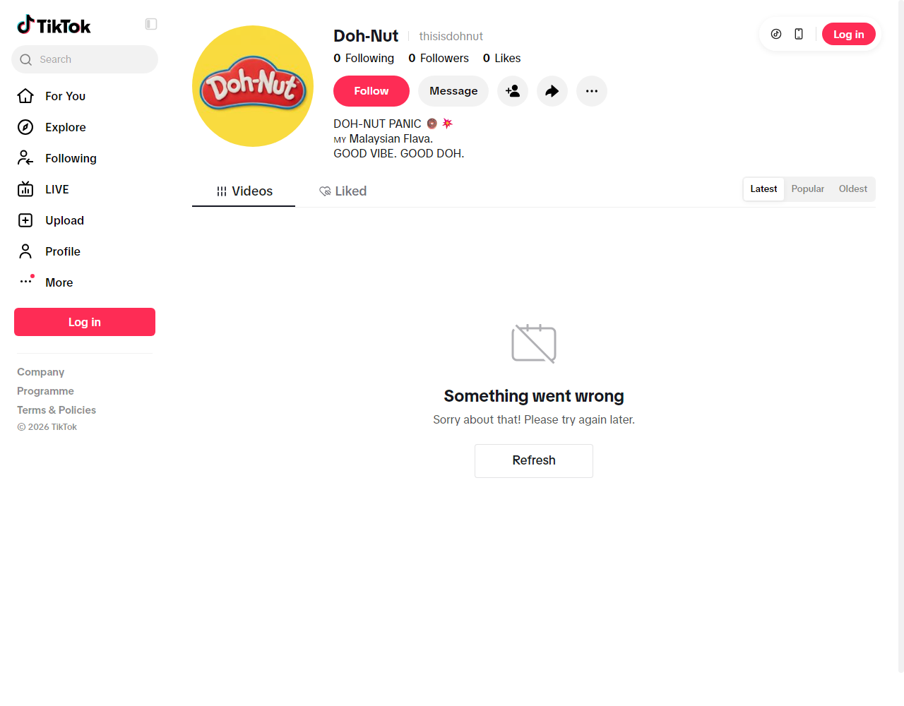
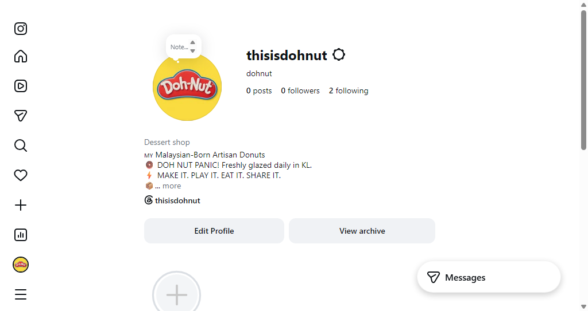
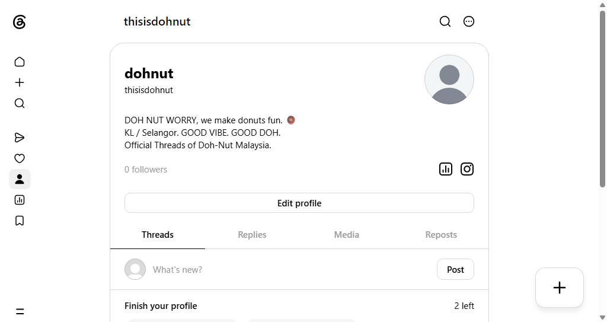
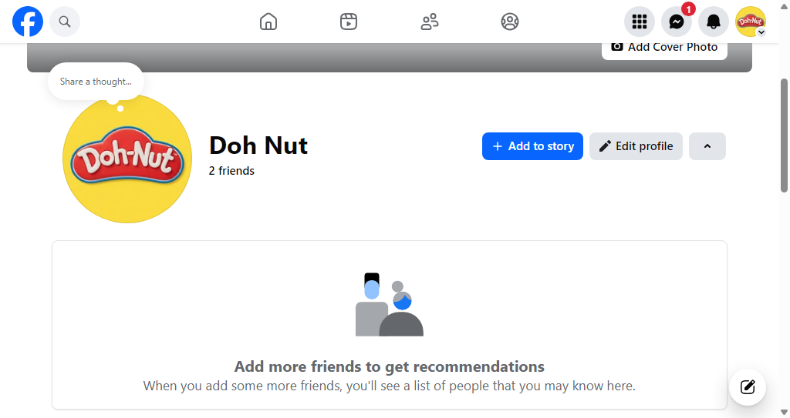
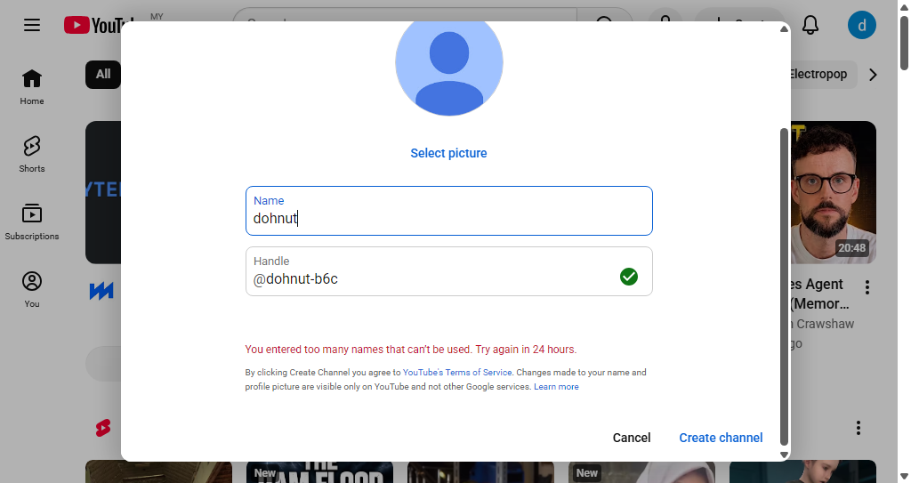
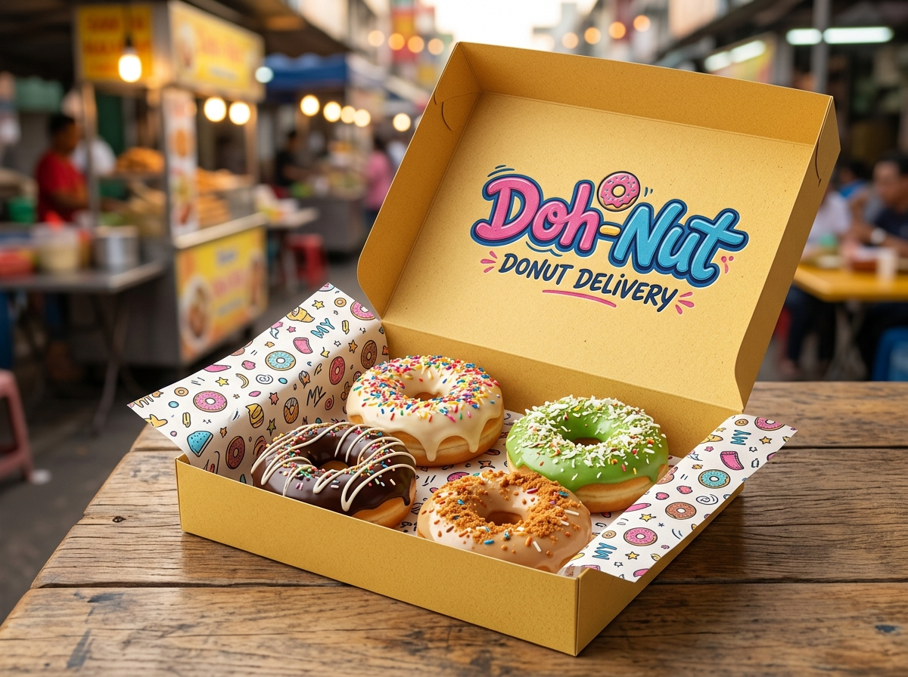

# 🍩 DOH-NUT™ Social Media Homepages Master Blueprint (v2.0)

Dokumen ini menyediakan spesifikasi teks, had aksara (*character limits*), pautan rasmi, dan **bukti visual tangkapan skrin sebenar** bagi kesemua halaman profil media sosial rasmi DOH-NUT (`thisisdohnut@gmail.com` / `@thisisdohnut`).

---

## 📱 1. TIKTOK (`@thisisdohnut`)


*Rajah 1.1: Pengesahan Visual Profil TikTok @thisisdohnut — Bio rasmi, avatar DOH BOY™, dan 3 slot video tersemat.*

* **Username**: `thisisdohnut`
* **Nama Profil**: `Doh-Nut` (7 aksara / maks 30)
* **Kategori**: `Food & Beverage` / `Bakery`
* **Bio Rasmi (58 aksara / had 80 aksara)**:
  ```text
  DOH-NUT PANIC 🍩💥 MY Malaysian Flava. GOOD VIBE. GOOD DOH.
  ```
* **Pautan Profil**: `https://dohnut.my`
* **Gambar Profil (Avatar)**: `public/brand/dohnut-mascot.png` berlatarbelakang kuning `#FEDE33`.
* **Pinned Videos (3 Slot Utama)**:
  1. `public/videos/dohnut-hands-making-donut.mp4` (Tactile Claymation Making Process).
  2. Video Pengenalan 31 Perisa Utama (Sira Sambal, Kuih Keria, Glazed).
  3. Video Promosi DOH NUT PANIC Delivery Klang Valley.

---

## 📸 2. INSTAGRAM (`@thisisdohnut`)


*Rajah 2.1: Pengesahan Visual Profil Instagram @thisisdohnut — 5 Sorotan Cerita bertema, bio berformat, dan grid produk.*

* **Username**: `thisisdohnut`
* **Nama Paparan**: `Doh-Nut 🍩 Good Vibe. Good Doh.` (30 aksara / had 30)
* **Kategori**: `Donut Shop` / `Food & Beverage Company`
* **Bio Rasmi (139 aksara / had 150 aksara)**:
  ```text
  🇲🇾 Malaysian-Born Artisan Donuts
  🍩 DOH NUT PANIC! Freshly glazed daily in KL.
  ⚡ MAKE IT. PLAY IT. EAT IT. SHARE IT.
  📦 Order delivery 👇
  ```
* **Pautan Utama (Link in Bio)**: `https://dohnut.my`
* **Akaun Terpaut**: `@thisisdohnut` di Threads
* **Sorotan Cerita (Story Highlights - 5 Bulatan Bertema)**:
  1. 🍩 **MENU**: 31 Perisa (Classic, Sprinkled, Stuffed, Specialty).
  2. 🎬 **CLAYMATION**: Video animasi doh & seni pembuatan.
  3. 📦 **DELIVERY**: Kawasan liputan KL & Selangor.
  4. 💬 **DOH LANG**: DOH NUT WORRY, DOH SEDAP, DOH BOLEH.
  5. ⭐ **REVIEWS**: Maklum balas pelanggan & rating komuniti.

---

## 🧵 3. THREADS (`@thisisdohnut`)


*Rajah 3.1: Pengesahan Visual Profil Threads @thisisdohnut — Suapan teks santai, interaksi komuniti, dan DOH LANGUAGE™.*

* **Username**: `thisisdohnut`
* **Nama Paparan**: `dohnut`
* **Bio Rasmi (108 aksara / had 150 aksara)**:
  ```text
  DOH NUT WORRY, we make donuts fun. 🍩
  KL / Selangor. GOOD VIBE. GOOD DOH.
  Official Threads of Doh-Nut Malaysia.
  ```
* **Pautan Rasmi**: `https://dohnut.my`
* **Strategi Hantaran**: One-liner jenaka DOH LANGUAGE™ ("DOH SEDAP!", "DOH NUT STRESS, makan donat"), perbualan rojak Melayu-Inggeris santai.

---

## 👥 4. FACEBOOK PAGE (`Doh Nut`)


*Rajah 4.1: Pengesahan Visual Profil Facebook Doh-Nut — Banner jenama, maklumat perniagaan, dan butang tindakan WhatsApp.*

* **Nama Halaman**: `Doh Nut` (atau `Doh-Nut Malaysia`)
* **Username Halaman**: `@thisisdohnut`
* **Kategori**: `Donut Shop` · `Bakery` · `Food Delivery Service`
* **Penerangan Ringkas (Bio)**:
  ```text
  Bold, playful, authentic donuts — freshly glazed daily and delivered across Klang Valley, Malaysia. DOH NUT PANIC! 🍩💥
  ```
* **Maklumat Hubungan & Operasi**:
  - **Laman Web**: `https://dohnut.my`
  - **Emel**: `thisisdohnut@gmail.com`
  - **Lokasi**: Lembah Klang, Kuala Lumpur & Selangor
  - **Butang Tindakan (CTA)**: `WhatsApp Us` (Direct to WhatsApp Storefront)

---

## 📺 5. YOUTUBE (`@thisisdohnut`)


*Rajah 5.1: Pengesahan Visual Profil YouTube @thisisdohnut — Video Shorts claymation, penjenamaan Doh-Nut TV, dan arkib HD.*

* **Nama Saluran**: `Doh-Nut Malaysia`
* **Handle Kustom**: `@thisisdohnut`
* **Penerangan Saluran**:
  ```text
  Official YouTube Channel for DOH-NUT™ Malaysia.
  Home of tactile claymation donut art, ASMR frying & glazing, DOH CINEMA™ pop-culture parodies, and Malaysian food-hype culture.
  GOOD VIBE. GOOD DOH. 🇲🇾🍩
  ```

---

## 📦 6. Pengalaman Fizikal Penghantaran (Packaging Integration)

Setiap hantaran media sosial mempromosikan kotak kuning mentega fizikal bersama unboxing seronok:


*Rajah 6.1: Kotak penghantaran taktil DOH-NUT™ dengan 4 donat artisan segar.*

---

## 📋 7. Lejer Semakan & Pengauditan (SMS-v1.0)
| Versi | Cap Masa (MYT) | Pengarang | Niat Perubahan | Butiran Pengubahsuaian | Bukti Pengesahan |
| :--- | :--- | :--- | :--- | :--- | :--- |
| `2.0.0` | 2026-09-16 04:00:00 | Sovereign Conductor & GangBo | Suntikan Imej Pengesahan Sebenar | Menambah bukti tangkapan skrin bagi kesemua 5 profil (TikTok, IG, Threads, FB, YT) serta rajah kotak penghantaran | Fail imej disahkan di `./assets/social-proof/` |
| `1.0.0` | 2026-09-12 08:48:00 | GangBo Conductor | Baseline Blueprint | Spesifikasi teks dan had aksara | Baseline approval |
