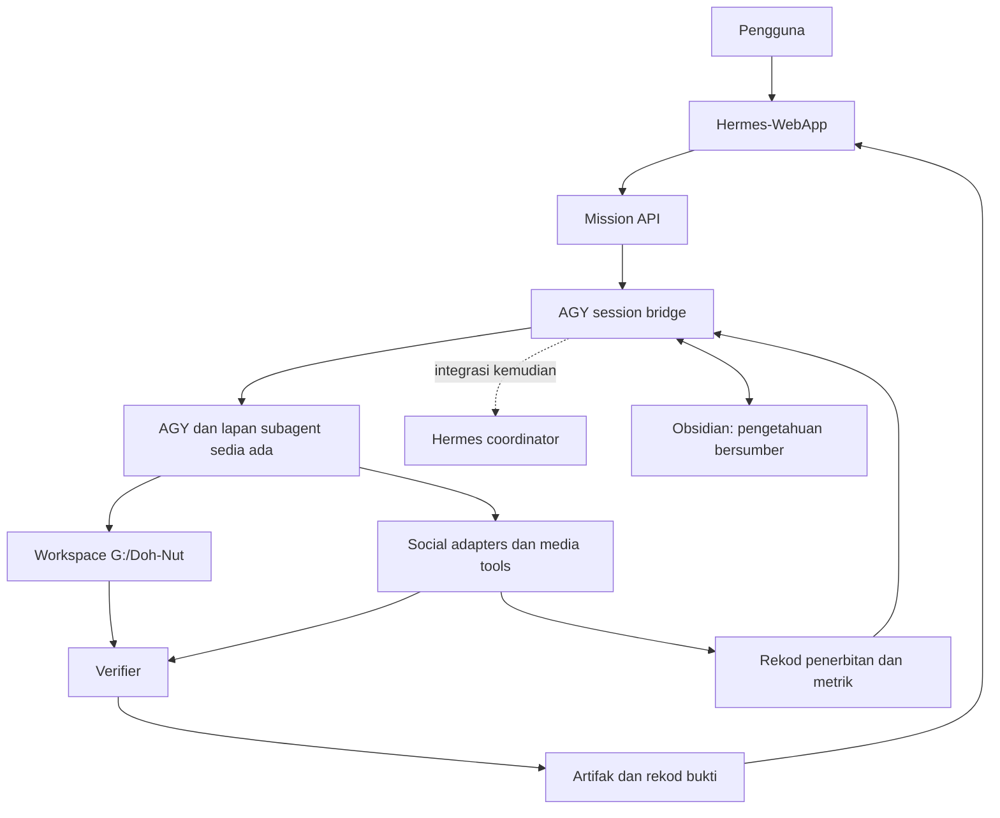

# Synthesis Sistem Hermes

## 1. Keputusan utama

Berdasarkan penjelasan pengguna, AGY CLI sudah disediakan untuk kerja social media dan mempunyai lapan subagent sebelum pembangunan Hermes-WebApp. Masalah utama ialah pengguna perlu berada di PC untuk bercakap dengan AGY. Keutamaan ialah menjadikan Hermes-WebApp antara muka jauh kepada setup AGY sedia ada, sambil mengekalkan projek `G:/Doh-Nut`, agents, tools, identiti dan perbualan yang berkaitan. Keupayaan operasi AGY ini dilaporkan oleh pengguna; laluan remote belum disahkan end to end.

Pembetulan arah: cadangan terdahulu yang menjadikan native Hermes pengganti executor utama dan AGY worker pilihan tidak sepadan dengan keperluan yang dijelaskan. Hermes boleh menjadi lapisan penyelaras tambahan kemudian; nama Hermes-WebApp tidak memerlukan penggantian enjin AGY yang sudah digunakan.

Sasaran advanced: menyelesaikan kerja merentas aplikasi, mengekalkan konteks projek, menghasilkan artifak, pulih daripada gangguan, dan memperbaik prosedur berdasarkan hasil terukur. Keunggulan berbanding workflow model lain perlu dibuktikan pada task setara; tiada dakwaan menang semua benchmark atau operasi tanpa batas.

Dokumen ini menyatukan perbualan dan audit dalam sesi 2026-09-16. Ia bukan audit semula penuh. Maklumat runtime ialah snapshot semakan terakhir dalam sesi; keadaan boleh berubah semasa pembangunan berjalan.

## 2. Skop dan pemilikan

| Komponen | Lokasi | Tanggungjawab |
| --- | --- | --- |
| Projek pertama | `G:/Doh-Nut` | Brand rules, aset, katalog/interface perniagaan, hasil kempen dan semakan khusus projek |
| Antara muka operasi | `C:/Users/megat/Hermes-WebApp` | Brief, semakan, kelulusan, kalendar, kemajuan, bukti dan analytics |
| Executor dan pasukan sedia ada | AGY CLI dan lapan subagent | Mengekalkan workflow social Doh-Nut yang pengguna sudah setup; akses melalui sesi yang tepat |
| Penyelarasan tambahan | Pemasangan Hermes sedia ada | Integrasi lanjut apabila diperlukan; bukan prasyarat menggantikan workflow AGY |
| Memory | `C:/Users/megat/ObsidianVault/Hermes-Obsidian` | Keputusan, rujukan, runbook dan sejarah berasaskan bukti |
| Pelaksanaan platform | Adapters/API/WebBridge yang disahkan | Identiti akaun, upload, posting, status dan kutipan metrik |

Pengguna memilih Doh-Nut dahulu; jenama lain menyusul melalui konfigurasi projek berasingan. Perubahan operasi berada dalam WebApp dan worker; storefront pelanggan tidak memerlukan dashboard social baharu.

## 3. Keadaan sebenar

| Keadaan | Bukti sesi | Implikasi |
| --- | --- | --- |
| Disahkan pada runtime | WebApp mendengar pada 127.0.0.1:9220; accounts GET memberi HTTP 200 | WebApp boleh dicapai; respons itu tidak mengesahkan kebenaran penerbitan |
| Disahkan pada runtime | WebBridge melaporkan daemon hidup dan extension bersambung pada semakan terkini | Semakan awal yang gagal telah digantikan oleh snapshot ini; akaun browser khusus masih perlu disemak |
| Disahkan pada fail | 105 post dirancang untuk 7 hari dan 5 platform; semua rujukan fail media wujud | Bahan boleh diimport sebagai draf; belum bererti media sah atau post diterbitkan |
| Disahkan pada source | Hermes mempunyai Kanban, delegation, dan `kanban_swarm.py` dengan specialist/verifier/synthesizer | Gunakan semula asas ini; aktivasi runtime dan integrasinya masih perlu diuji |
| Disahkan pada source | Default spawn WebApp tanpa custom command menjalankan simulasi 12 saat | Default task completion belum menunjukkan kerja Hermes |
| Disahkan pada source | Publish WebBridge dalam WebApp hanya navigate | Kandungan tidak dikarang atau dimuat naik oleh handler tersebut |
| Disahkan pada source | Approve mengubah database, menetapkan `published_at`, dan memulangkan `platforms_dispatched` tanpa publisher | Status perlu dibetulkan sebelum dijadikan bukti operasi |
| Disahkan pada source | VERIFIED akaun ialah literal; campaign generators yang diperiksa menggunakan template tetap | Pemeriksaan akaun dan penjanaan berasaskan konteks perlu disambungkan |
| Disahkan pada source | Stats mengandungi angka contoh dan blok live pilihan | Data contoh tidak boleh memandu keputusan kempen |
| Belum lengkap | `G:/Doh-Nut/mini-services/social-sync/posts_history.db` tiada; skrip social melakukan simulasi | Rekod penerbitan dan deduplication belum dibuktikan pada laluan ini |
| Ujian gagal | Validator blueprint tempatan exit 1: Facebook contact/banner, X bio length, YouTube spec | Ralat dokumen tempatan; bukan diagnosis akaun sebenar |
| Laluan remote belum berjaya dua hala | Ujian invocation AGY memberi conversation ID tetapi timeout 40 saat dengan respons kosong | Kegagalan probe ini tidak membuktikan workflow AGY interaktif pengguna rosak |

Semakan selepas penjelasan pengguna: `agy remote-control --help` menunjukkan start/status/stop, dan `agy remote-control status` mengembalikan `Daemon status: not registered`. CLI menyediakan calon laluan remote native, tetapi belum disahkan bahawa ia boleh dibenamkan dalam WebApp atau menyambung sesi sedia ada. Tiada daemon dimulakan atau didaftarkan oleh semakan ini.

Source WebApp yang diperiksa menunjukkan `/ws/terminal` membuka `pwsh.exe` pada `C:/Users/megat` dan menamatkan proses shell apabila socket terputus. Handler Telegram `forward_to_n8n` menghantar teks ke webhook n8n. Ini belum merupakan sesi AGY khusus yang boleh dipulihkan dari telefon; downstream n8n tidak diaudit di sini.

Audit Hermes lebih awal turut menemukan config aktif AppData berbeza daripada `~/.hermes`, primary model/fallback tidak lengkap, chat biasa tersangkut dan scheduled healthcheck gagal. Dapatan ini belum disemak semula sepenuhnya; lakukan baseline semasa sebelum implementasi.

## 4. Seni bina sasaran



### Satu pemilik bagi setiap jenis status

- Session bridge memetakan pengguna/project kepada sesi AGY yang betul, mengekalkan run dan conversation ID, serta mengurus input, output dan reconnect.
- Database aplikasi mengurus campaign, content version, approval, publication attempts, remote IDs dan analytics.
- Rekod aplikasi dipautkan kepada session/task/run ID. Inventori scheduler dan automation AGY sedia ada sebelum menambah queue atau memindahkan tugas kepada Hermes Kanban.
- Fail hasil disimpan secara durable dengan versi/hash; WebApp memaparkan rujukan hasil itu.
- Obsidian menyimpan pengetahuan dan keputusan. Ia bukan database lock/queue untuk worker.
- Setiap tindakan luaran mengikut autoriti pengguna yang direkodkan; teks dalam laman web, komen pelanggan atau dokumen tidak memberikan autoriti baharu.

## 5. Aliran pertama yang mesti hidup

Contoh brief: "Sediakan kempen Doh-Nut minggu depan berdasarkan produk yang tersedia, lengkap dengan caption dan media untuk semakan."

1. WebApp menerima brief dan mengesahkan projek, tarikh, deliverables dan had tindakan.
2. Session bridge menghantar arahan kepada AGY dalam projek dan sesi yang dipilih; pulangkan run/conversation ID.
3. AGY menggunakan agents, tools dan konteks projek sedia ada. Pastikan pemilihan project/profile tidak berubah apabila dilancarkan dari WebApp.
4. Planner menetapkan task serta syarat siap. Worker menghasilkan content dan media sebenar.
5. Verifier menyemak fakta, brand, media, pautan dan kesepadanan dengan brief.
6. WebApp menunjukkan draf, artifak, log relevan dan keputusan semakan daripada run sebenar.
7. Selepas laluan penerbitan tersedia dan autoriti mencukupi, task bertarikh dihantar kepada publisher.
8. Publisher menyimpan hasil platform; verifier menyemak post; analytics menghasilkan task susulan yang berasas.

Milestone pertama membuktikan pengguna boleh bercakap dengan AGY dari WebApp, menerima output sebenar, memberi follow-up dalam sesi sama dan mendapatkan hasil yang setara dengan penggunaan PC. Gunakan task draf/semakan supaya ujian akses tidak memerlukan penerbitan baharu.

## 6. Kontrak worker, termasuk AGY

Setiap worker menerima task ID, run ID, project ID, workspace yang dibenarkan, objektif, input references, tools yang dibenarkan, deadline, bajet dan acceptance checks.

Worker mengembalikan status, artifact references, bukti ujian, soalan/blocker, sebab gagal, next action dan penggunaan sumber. Had keseluruhan misi merangkumi semua workers, retries dan reviewers; bajet child tidak boleh membesar tanpa kawalan.

Untuk AGY, CLI help mengesahkan print mode, output JSON/stream JSON dan resume melalui conversation ID. Ujian dalam sesi ini mengembalikan:

```text
print timeout after 40s with turn in progress
response: empty
conversation_id: 6f7acdcc-8f21-4726-82d1-b22593258a6e
```

Label `SUCCESS` dalam envelope tersebut tidak mengatasi bukti bahawa jawapan kosong. Adapter mesti memeriksa hasil dan syarat siap, mengurus timeout/cancellation, dan memastikan tiada worker tertinggal. Jangan gunakan "continue latest" untuk banyak task serentak; pautkan conversation ID kepada task yang betul. Siasat punca timeout pada laluan print/remote tanpa menganggap setup AGY interaktif pengguna perlu diganti.

Nilai remote-control native terlebih dahulu sebagai laluan yang mungkin paling sedikit perubahan, termasuk cara auth, pemilihan projek dan keserasian WebApp. Jika permukaan itu tidak sesuai untuk integrasi tersuai, gunakan print/stream-json dengan conversation IDs setelah diuji, atau terminal/PTY yang sesuai jika runtime memerlukannya. Jangan mereka protokol daemon daripada nama command sahaja. Semua sambungan mesti mempunyai autentikasi, pengasingan sesi dan pengurusan secrets yang sesuai untuk akses melalui telefon.

## 7. Social automation yang lengkap

### Content dan fakta

Gunakan material kempen sedia ada sebagai draf. Tetapkan start date sebelum menukar day number dan clock string kepada timestamp sebenar. Semak versi brand rules, harga, stok, promosi, waktu operasi dan janji penghantaran. Kewujudan 31 item dalam katalog tidak bermaksud semuanya dijual atau tersedia pada setiap masa.

### Akaun dan akses

Daftar platform account ID, jenis akaun, kemampuan yang disahkan, token reference, expiry dan waktu pemeriksaan. Handle/URL atau badge VERIFIED tidak mencukupi. Pastikan browser automation menggunakan akaun/tab yang betul dan mengawal konflik apabila beberapa task berkongsi browser.

### Publication lifecycle

```text
draft -> validating -> awaiting_approval -> approved -> scheduled
      -> publishing -> processing -> published -> verified

Side states: needs_revision, blocked, failed, reconciliation_required, cancelled
```

Kelulusan terikat kepada versi caption, media, akaun dan jadual. Perubahan material memerlukan kelulusan semula mengikut skopnya. Approval tidak menetapkan published_at. Permintaan upload diterima belum bererti post kelihatan. Setiap platform mempunyai rekod sendiri dan campaign boleh berjaya separa.

Apabila respons tidak pasti, semak keadaan platform sebelum retry. Gunakan deduplication key, rekod remote request ID dan reconciliation; database tempatan sahaja tidak menjamin exactly-once pada servis luar.

### Analytics dan community

Kumpul metrik yang benar-benar tersedia dengan timestamp dan source; bezakan zero, unavailable dan delayed. Gunakan pautan bertag dan data jualan yang sah untuk analisis, sambil menerangkan batas attribution. Waktu posting sedia ada ialah hipotesis yang boleh diuji, bukan jaminan FYP.

Community automation ditambah selepas akses inbox/replies disahkan dan peraturan respons ditetapkan. Pertanyaan pelanggan tentang order, alergen, refund atau stok memerlukan data semasa dan autoriti yang sesuai.

### Batas platform

Laluan Instagram/Meta perlu dipilih mengikut jenis akaun dan login flow sebenar. TikTok Direct Post mempunyai sekatan audit, intended use dan user controls; custom uploader dalaman tidak boleh dianggap layak secara automatik. Nilai integrasi yang sesuai dan disokong. Browser automation tidak dengan sendirinya menyelesaikan batas platform. Tiada jaminan zero-cost, anti-shadowban atau viral.

## 8. Apa yang menjadikannya advanced

| Keupayaan | Pelaksanaan yang boleh diukur |
| --- | --- |
| Memilih strategi | Cuba pendekatan berbeza bagi masalah sukar dan pilih melalui eksperimen kecil |
| Mengarah workers | Tugasan mempunyai kontrak, dependencies dan workspace; delegasi berdasarkan keperluan |
| Mengingati dengan betul | Retrieval bersumber, bertarikh, berasingan mengikut projek dan mengesan fakta bercanggah |
| Menghasilkan deliverables | Media/dokumen/kod sebenar dengan versi dan rujukan tersimpan |
| Memulihkan kerja | Rekod durable, bounded retries, sebab kegagalan dan sambungan daripada bukti |
| Menyemak sendiri | Checks objektif dan reviewer mengawal completion pada versi hasil yang sama |
| Memperbaik prosedur | Perubahan skill/router diuji pada task berasingan sebelum promotion, dengan rollback |

Self-improvement di sini memperbaik sistem, tools dan prosedur. Ia tidak bermaksud model weights dilatih semula. Sistem mesti kekal boleh dihentikan pengguna dan mematuhi had sumber.

## 9. Urutan pembangunan

| Milestone | Kerja | Syarat lulus |
| --- | --- | --- |
| M0: Peta workflow sedia ada | Kenal pasti sesi/project AGY, lapan agents, tools, akses akaun dan cara pengguna menjalankan social tasks; siasat probe timeout | Baseline penggunaan PC difahami tanpa menggantikan atau menimpa setup |
| M1: Remote conversation | Sambung WebApp kepada sesi AGY yang betul | Arahan dan jawapan sebenar boleh diakses; follow-up mengekalkan conversation ID dan project Doh-Nut |
| M2: Parity dengan PC | Jalankan task melalui agents/tools yang sama | Hasil dan delegation yang diperlukan setara dengan workflow PC; draf dan artifak boleh dibuka dalam WebApp |
| M3: Reconnect dan kawalan | Simpan events/status, asingkan lifecycle proses daripada socket, sokong cancel dan approval sedia ada | Telefon disconnect/reload tidak menggandakan atau memadam task; pengguna boleh menyambung |
| M4: Lengkapkan jurang sebenar | Bezakan demo/status, tambah calendar/analytics/publisher hanya apabila baseline menunjukkan keperluan | Tiada pembinaan semula automasi yang sudah berfungsi; penerbitan mempunyai bukti |
| M5: Hermes dan multi-brand | Tambah koordinasi Hermes apabila berguna dan pemetaan jenama lain | Integrasi meningkatkan workflow yang diukur sambil mengekalkan pemilikan sesi dan data |

Komunikasi remote AGY ialah milestone utama. Penerbitan yang sudah tersedia pada workflow PC mesti digunakan semula setelah dipetakan; kewujudan mock dalam WebApp tidak membuktikan ketiadaan automasi di luar WebApp. Tiada anggaran masa/kos muktamad sebelum laluan integrasi dan compatibility disahkan.

## 10. Verification dan batas pelaksanaan

- Uji approval tanpa publication, hasil publish gagal, stale approval, akaun salah, timeout selepas remote acceptance, restart worker, dan cancellation.
- Uji bahawa content berubah secara relevan apabila brief, produk dan tone berubah.
- Uji bahawa data contoh tidak digunakan sebagai prestasi bisnes dan failed checks menghalang status done.
- Bandingkan sistem lama/baharu pada task yang sama dengan bajet, tools dan bukti yang setara. Lapor completion, kesilapan serius, masa, kos dan campur tangan pengguna.
- Kekalkan native Windows setup, port/tunnel sedia ada dan Sovereign Sentinel. Operasi ketika PC mati memerlukan host lain; tiada konfigurasi yang menghapuskan keperluan itu.
- Kedua-dua repositori mempunyai perubahan tempatan. Baca semula fail sebelum edit; jangan reset, reinstall atau overwrite kerja pengguna.
- Implementation belum dilakukan oleh synthesis ini. Tiada post, mesej, deployment, credential rotation atau perubahan runtime dibuat.

## 11. Rujukan

- Audit integrasi dan file/line evidence: [hermes-social-conductor-integration-2026-09-16.md](hermes-social-conductor-integration-2026-09-16.md).
- Cadangan advanced awal: `C:/Users/megat/ObsidianVault/Hermes-Obsidian/20-Operations/hermes-advanced-agent-blueprint-2026-09-16.md`.
- [Hermes Kanban](https://hermes-agent.nousresearch.com/docs/user-guide/features/kanban).
- [Hermes worker lanes](https://hermes-agent.nousresearch.com/docs/user-guide/features/kanban-worker-lanes).
- [Meta Instagram API collection](https://www.postman.com/meta/instagram/documentation/6yqw8pt/instagram-api).
- [TikTok Content Sharing Guidelines](https://developers.tiktok.com/docs/en/content-sharing-guidelines).

Keputusan pembangunan pertama: buktikan satu perbualan dan follow-up WebApp ke AGY dalam projek Doh-Nut, menggunakan setup sedia ada. Kemudian buktikan task subagent menghasilkan artifak dan kekal boleh diikuti selepas telefon reconnect. Cadangan pembangunan sebelum penjelasan pengguna telah digantikan oleh keutamaan remote-access ini.
